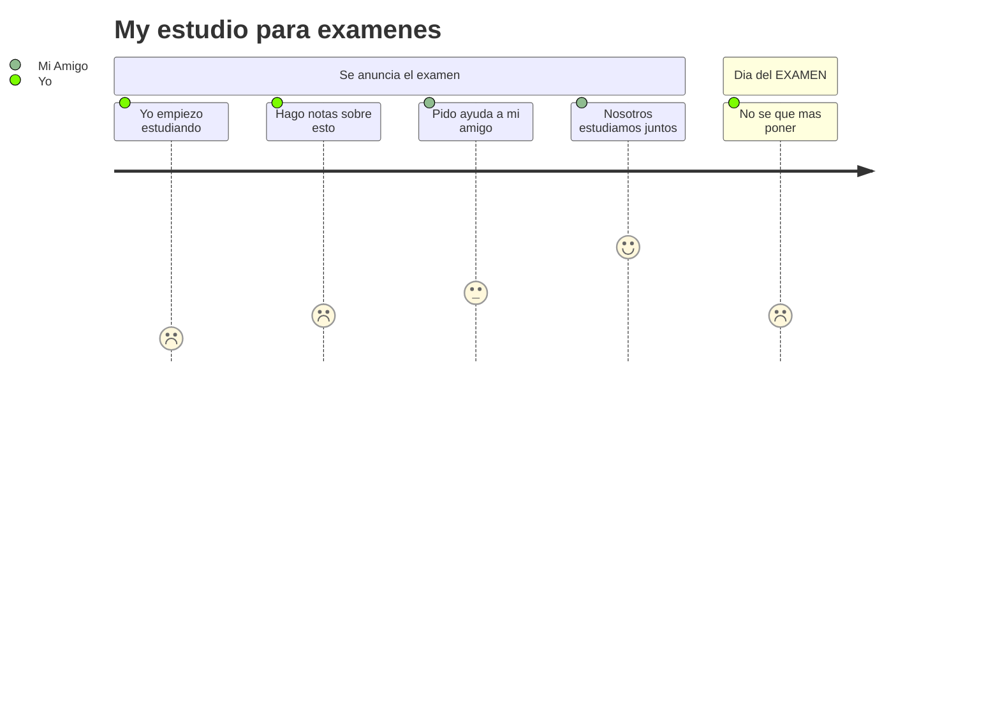

# Creando un Github Profile Hermoso
En este repositorio explicare las diferentes tecnicas que existen para estilizar de la mejor forma un perfil en github utilizando varias herramientas, repositorios externos y como no, nuestra creatividad a la hora de ponerlos en marcha.
<br>
<br>
**Cabe recalcar que este archivo README lo creare de la manera mas simple para no distraer la vista del lector, sin mas que añadir, continuemos.**

## Indice
- [Introduccion](#Introduccion)
- [Creando nuestro repositorio](#Creando-nuestro-repositorio)
  - [Nota](#nota)
- [Conceptos Basicos](#conceptos)
  - [Estructuras y conceptos basicos](#estructura-basica)
    - [Propiedades Basicas](#propiedades)
      - [Titulos](#titulos)
      - [Soporte Html](#soporte-html)
      - [Soporte Para imagenes](#soporte-imagenes)
- [Herramientas integradas en github](#Herramientas)
  - [mermaid](#mermaid)


<div id="Introduccion">
  <h1>Introduccion</h1>
  <p>Lo primero que debemos saber es que los perfiles de github se crean sobre un repositorio con nuestro nombre.</p>
  <p>Este repositorio contiene un archivo README.md el cual utiliza un lenguaje de marcado llamado MARKDOWN. Este permite crear salidas de texto estilizadas de una manera sencilla, aunque su limitante mas grande es sin duda la poca flexibilidad a la hora de agregar estilos.</p>
</div>

<div id="Creando-nuestro-repositorio">
  <h1>Creando nuestro repositorio</h1>
  <ul>
    <li>
      <p>Lo primero que debemos hacer es ir a a la ventana repositoiros</p>
      <kbd>
        
      </kbd>
    </li>
    <li>
      <p>Seguido a esto le daremos al boton de la derecha: New</p>
      <kbd></kbd>
    </li>
    <li>
      <p>Seguido a esto veremos una pagina titulada "Create a new repository", destro de esta es donde crearemos nuestro repositorio</p>
    </li>
    <li>
      <p>Con la mirada buscaremos el recuadro llamado "Repository name" aqui pondremos nuestro nombre de usuario, en mi caso: Bryan-Herrera-Dev.</p>
      <p>Si no sabes donde encontrar tu nombre de usuario en el recuadro de alado esta, solo copialo y pegalo.</p>
      <kbd></kbd>
      <p>Como vemos a mi me tira un error, pues ya tengo dicho repositorio.</p>
      <p>Para verificar que lo hicimos bien, debajo a estos recuadros tendremos un mensaje de github diciendo que hayamos un secreto. Si no muestra este mensaje comprueba que hayas puesto bien tu nombre de usuario.</p>
    </li>
    <li>
      <p>Luego iremos hasta la parte de abajo, marcaremos la opcion "Add a README file" y luego presionaremos el boton "Create Repository"</p>
      <kbd></kbd>
    </li>
    <li>
      <p>Cuando vayamos a nuestro perfil veremos algo asi: </p>
      <kbd></kbd>
    </li>
    <li>
      <h4 id="nota">Nota: </h4>
      <p>Estare usando una cuenta secundaria para crear de cero el archivo.</p>
    </li>
  </ul>
</div>

<div id="conceptos">
  <h2>Conceptos basicos</h2>
  <p>Una vez creado el repositorio, iremos a nuestros a la ventana repositorios y  abriremos la repo con nustro nombre de usuario. Abriremos el repositorio y veremos algo asi: </p>
  <kbd></kbd>
  <p>Abrirmos el archivo README.md, le daremos al boton "Edit this file"</p>
  <kbd></kbd>
  <p>Cuando lo abramos borraremos todas las lineas que aparezcan y tendremos un archivo vacio.</p>
  <div id="estructura-basica">
    <h2>Estructuras y elementos basicos</h2>
    <p>Antes de comenzar con los aspectos esteticos debemos tomar en cuenta la estructura que le daremos a nuestro archivo puesto que, si tienes los elementos dispersos por cualquier sitio daria exactamente igual.</p>
    <div id="propiedades">
      <h2>Propiedades Basicas</h2>
      <ul>
        <li>
          <h3 id="titulos">Titulos</h3>
          <p>En Markdown podemos definir varios tipos de título, si conoces un poco de HTML sabrás que tenemos 5 jerarquías para esto y aquí podemos hacer referencia a esa jerarquía de dos maneras: por medio de etiquetas y por numerales <code>#</code></p>
          <p>Por medio de etiquetas:</p>

```html
  <h1>Titulo</h1>
  <h2>Titulo</h2>
  <h3>Titulo</h3>
  <h4>Titulo</h4>
  <h5>Titulo</h5>
```
  <p>Por medio de numerales:</p>

```markdown
  # Titulo
  ## Titulo
  ### Titulo
  #### Titulo
  ##### Titulo
  ###### Titulo
```
</li>

<li>
  <h3 id="soporte-html">Soporte para HTML</h3>
  <p>Con markdown tenemos soporte para HTML y escribir nuestra estructura con este, pero, no todas las propiedason permitidas, un ejemplo: <b>input, select, etc</b></p>
</li>
<li>
          <h3 id="soporte-imagenes">Soporte para imagenes</h3>
          <p>En GitHub Markdown tenemos soporte para insertar imágenes y darles tamaños específicos. Para esto hay dos maneras principales, por medio de Markdown o insertarlas como una etiqueta HTML:</p>
          <p>Markdown:</p>
          <pre><code></code></pre>
          <p>HTML:</p>
          <pre><code>&lt;img src="https://myoctocat.com/assets/images/base-octocat.svg" width="200" height="200" alt="octocat"&gt;</code></pre>
          <p><b>Nota: </b>Si quieres que la imagen se vea en su tamaño original, solo debes dejar el ancho y alto en blanco</p>
          <p>En GitHub también tenemos soporte para imágenes que cambian dependiendo el tema del usuario 'Dark' o 'Light', esta propiedad es relativamente nueva y podemos implementarla así:</p>

```html
  <picture>
    <source media="(prefers-color-scheme: dark)" srcset="https://user-images.githubusercontent.com/25423296/163456776-7f95b81a-f1ed-45f7-b7ab-8fa810d529fa.png">
    <source media="(prefers-color-scheme: light)" srcset="https://user-images.githubusercontent.com/25423296/163456779-a8556205-d0a5-45e2-ac17-42d089e3c3f8.png">
    
  </picture>
```
<p>Otro dato muy interesante que con las etiquetas <code>&lt;kbd&gt;&lt;/kbd&gt;</code> puedes agregar un margen de color a las imágenes, aunque es casi imperceptible le da un toque más estético a estas.</p>
<pre><code>&lt;kbd&gt;&lt;img src="https://myoctocat.com/assets/images/base-octocat.svg" width="200" height="200" alt="octocat"&gt;&lt;/kbd&gt;</code></pre>
</li>
</ul>
</div>
    
  </div>
</div>
  
# Herramientas integradas en github
Herramientas que github implementa en su markdown para crear elementos visuales

## Mermaid

